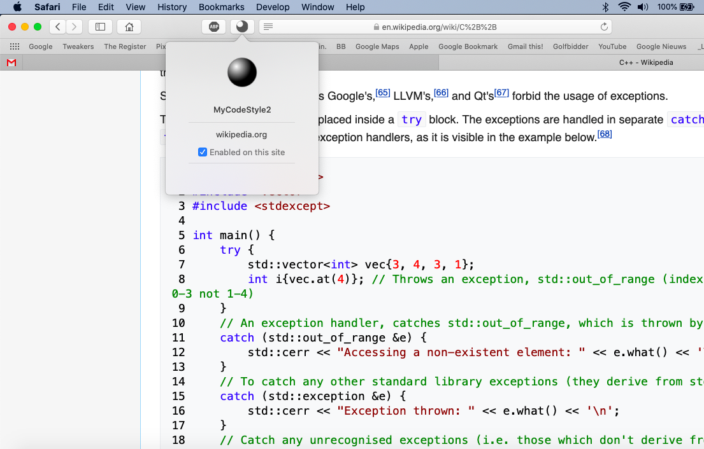

# MyCodeStyle2
Safari 13 App Extension to get Visual Studio code colors in Wikipedia

See: https://developer.apple.com/documentation/safariservices/safari_app_extensions/building_a_safari_app_extension?language=objc

## Enable Your App Extension in Safari

If you’re not part of the Apple Development Program, or if you haven’t yet configured a developer identity for your existing Xcode project, your Safari App Extension won’t be signed with a development certificate. For security purposes, Safari, by default, ignores unsigned extensions, so your extension won’t show up in Safari Extensions preferences.
To develop without a certificate, each time Safari is launched, you must tell it to load unsigned extensions using the Develop menu:

1. Open Safari and choose Safari > Preferences.
2. Select the Advanced tab, then select the “Show Develop menu in menu bar” checkbox.
3. Choose Develop > Allow Unsigned Extensions. The Allow Unsigned Extensions setting is reset when a user quits Safari; you must set it again the next time Safari is launched.
4. Select the Extensions tab. This tab shows the localized description, display name, and version number for the selected Safari App Extension. It also provides a more nuanced message about the permissions claimed by the extension.
5. Find your new extension in the list on the left, and enable it by selecting the checkbox.
6. Close Safari Preferences.
